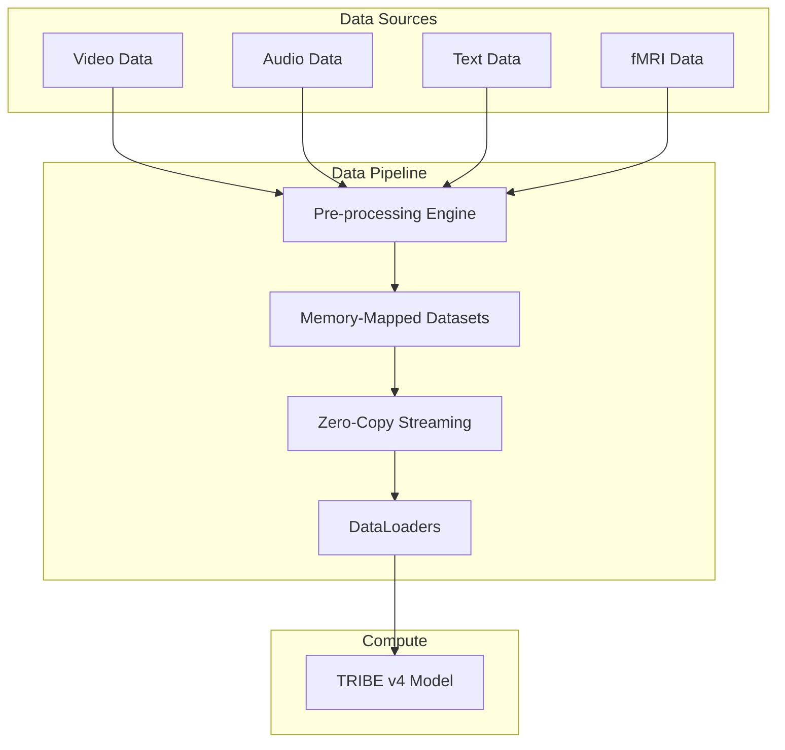
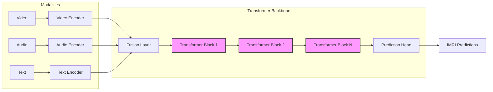
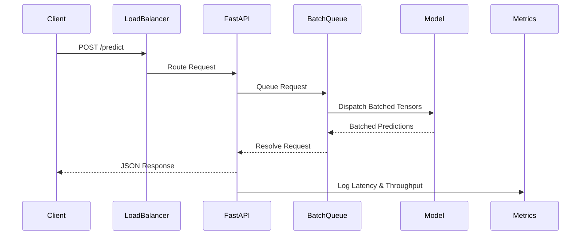

# TRIBE v4 Ultra - Architecture Documentation

This document provides a high-level overview of the architectural components, data flows, and deployment topology of the TRIBE v4 Ultra framework.

## System Architecture (Data Flow)

The data flow highlights how multi-modal inputs are ingested, processed, and streamed to the training or inference systems efficiently using memory-mapped structures.



## Model Architecture

The core predictive model utilizes an advanced multi-modal transformer architecture, leveraging FlashAttention-2 and kernel fusion for extreme performance.



## API Request Flow

When deployed in production, incoming API requests are routed through a FastAPI interface with built-in batching, rate-limiting, and metric tracking.



## Deployment Topology

The enterprise deployment strategy uses a scalable Kubernetes architecture to balance traffic across multiple GPU nodes.

```mermaid
flowchart TD
    User((User)) --> Ing[Ingress/Load Balancer]
    
    subgraph Kubernetes Cluster
        Ing --> API1[FastAPI Pod 1]
        Ing --> API2[FastAPI Pod 2]
        Ing --> APIN[FastAPI Pod N]
        
        API1 --> Redis[Redis Cache/Queue]
        API2 --> Redis
        APIN --> Redis
        
        subgraph GPU Nodes
            Redis --> Worker1[Model Worker Pod (GPU)]
            Redis --> Worker2[Model Worker Pod (GPU)]
        end
        
        Prom[Prometheus] --> API1
        Prom --> API2
        Prom --> Worker1
    end
```
